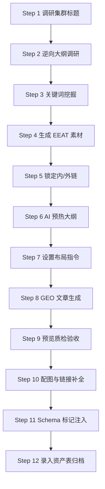

<div align="center">

# 📑 B2B 高转化内容集群执行标准 (SOP)
### B2B Content Cluster Strategy: EEAT + GEO + Structured Data

[](#)
[](#)
[](#)

> **适用场景**：产品型文章集群 / 工程类文章集群 / 认证类文章集群  
> **核心目标**：生产满足 EEAT + GEO + 结构化数据要求的高转化 B2B 内容资产。

</div>

<br/>

## 🧭 执行导航 (Quick Navigation)

| 📂 策略规划 (Phase A) | ✍️ 创作执行 (Phase B) | 🚀 优化发布 (Phase C) |
| :--- | :--- | :--- |
| [01. 集群标题调研](#step-1) | [05. 内外链规划](#step-5) | [09. 质量验收检查](#step-9) |
| [02. 竞对大纲调研](#step-2) | [06. 向 AI 输入大纲](#step-6) | [10. 多媒体补全](#step-10) |
| [03. 关键词矩阵挖掘](#step-3) | [07. 布局与 EEAT 指令](#step-7) | [11. 结构化数据标记](#step-11) |
| [04. EEAT 素材生成](#step-4) | [08. GEO 文章生成](#step-8) | [12. 资产录入归档](#step-12) |

---

## 🏗️ 文章集群类型架构说明 (Cluster Definitions)

针对 B2B 决策链条，将内容分为 8 大垂直集群，确保覆盖用户从“认知”到“采购”的完整路径：

| 一级集群类型 | 核心要回答的问题 | 典型标题方向 | 适合覆盖的内容 | 漏斗阶段 | 商业价值 |
| :--- | :--- | :--- | :--- | :--- | :--- |
| **认知教育型** | 这是什么？ | What is X, X meaning | 定义、分类、基础知识 | TOFU | 拉新、主题入口 |
| **选型决策型** | 我该怎么选？ | How to choose, Buying guide | 选购标准、采购要点 | MOFU | 强，导向产品页 |
| **对比替代型** | X 和 Y 的区别？ | X vs Y, Alternative | 对比、优劣、替代方案 | MOFU | 强，意图明确 |
| **规格标准型** | 技术要求是什么？ | Specifications, Standards | 尺寸、参数、技术要求 | TOFU/MOFU | 强，建立专业度 |
| **应用场景型** | 它适合谁？ | Best for hotel, for retailers | 场景方案、项目适配 | MOFU/BOFU | 极强，B2B 转化 |
| **问题排查型** | 怎么做/解决？ | Troubleshooting, Manufacturing | 工艺、质控、解决方案 | TOFU/MOFU | 强，体现工厂经验 |
| **认证合规型** | 符合什么法规？ | Certification, compliance | 认证介绍、标准、合规 | MOFU/BOFU | 中高，信任价值 |
| **采购合作型** | 怎么和你合作？ | OEM vs ODM, Factory audit | 模式、MOQ、供应商筛选 | MOFU/BOFU | **最高 (询盘核心)** |

---

<h2 id="step-1">Step 1：调研文章集群标题</h2>

**目标**：为上面 8 种集群类型各规划 5-10 篇文章标题。

**操作步骤**：
1.  使用 `templates/article-cluster-research-template.md` 进行标题调研。
2.  从以下维度出发构建标题：
    *   **认知教育型**：What is X?, X meaning, X explained, X types, X uses。
    *   **选型决策型**：how to choose, buying guide, selection guide, best X for Y。
    *   **对比替代型**：X vs Y, compare, alternative, pros and cons, which is better。
    *   **规格标准型**：specifications, dimensions, standards, tolerance, technical requirements。
    *   **应用场景型**：best for hotel, for supermarkets, for retailers, for hospitals / villas。
    *   **工艺排查型**：manufacturing process, quality control, troubleshooting, why does X happen。
    *   **认证合规型**：certification explained, compliance requirements, CE / REACH / ISO。
    *   **采购合作型**：OEM vs ODM, MOQ, lead time, quotation guide, factory audit checklist。
3.  参考来源：Google 自动补全、SEMrush Topic Research、行业论坛问题。
4.  评估标准：有搜索量、有商业意图、与产品强相关。

---

<h2 id="step-2">Step 2：竞对大纲调研 → 撰写自有大纲</h2>

**目标**：通过分析竞对内容，制定差异化且更优质的文章大纲。

**操作步骤**：
1.  在 Google 搜索确认好的文章标题（使用目标关键词）。
2.  打开前 5 名竞对文章，逐一记录：H1/H2/H3 结构、字数、有无 FAQ、表格、操作步骤、案例、数据引用。
3.  分析共同点（必须覆盖）和差距（可以超越的点）。
4.  撰写自有大纲，要求：
    *   覆盖竞对共同覆盖的核心模块。
    *   加入竞对缺失的深度内容（工厂视角、实操案例）。
    *   预留 GEO 摘要位置（列表/答案/表格/步骤/FAQ 至少 3 种）。

---

<h2 id="step-3">Step 3：SEMrush 关键词挖掘</h2>

**目标**：从竞对文章中提取可用关键词，优化关键词布局。

**操作步骤**：
1.  在 SEMrush 中输入竞对文章 URL（Organic Research → Pages）。
2.  查看该页面排名的所有关键词。
3.  筛选条件：与文章大纲内容匹配、搜索意图一致、搜索量 > 100。
4.  关键词分类：
    *   **主关键词 (Primary)**：1 个，出现在标题、H1、首段。
    *   **次级关键词 (Secondary)**：3-5 个，分布在 H2/H3 和正文。
    *   **LSI/支持词 (Supporting)**：5-10 个，自然融入段落。

---

<h2 id="step-4">Step 4：生成工厂视角 EEAT 素材 (ChatGPT 辅助)</h2>

**目标**：生成第一人称的工厂经验与项目案例，增强 EEAT 中的 Experience。

**Prompt 结构指令**：
> "请扮演一名在 [行业] 工厂有 15 年经验的工程师/项目经理，基于以下大纲：[粘贴大纲] 及案例链接：[粘贴链接]。输出：1. 工厂第一视角的实操经验（300字）；2. 项目第一人称案例（300字），包含数据和结果。"

---

<h2 id="step-5">Step 5：确认内链 + 准备外链引用内容</h2>

**目标**：在生成文章前锁定所有链接资源，确保权重传递。

### 5.1 内链规划（先行确认）
| 类型 | 锚文本策略 | 来源页面 |
| :--- | :--- | :--- |
| **产品页内链** | 产品名称/功能词 | 核心落地页 |
| **案例页内链** | 行业+场景词 | 案例详情页 |
| **联系页内链** | CTA 词 (如"获取报价") | /contact 页面 |
| **同集群内链** | 相关主题词 | 同集群其他文章 |

### 5.2 外链引用内容准备
优先级：1. 行业权威媒体/数据；2. 同行/上下游标准；3. Wikipedia；4. 国际知名案例。

---

<h2 id="step-6">Step 6：向 AI 输入大纲 (理解确认)</h2>

**操作指令**：
> "以下是我需要你创作的文章大纲，请先仔细阅读并确认理解：[粘贴大纲]。请确认你理解了逻辑结构、深度技术需求及工厂经验插入点。回复 '已理解大纲' 即可，不要开始写文章。"

---

<h2 id="step-7">Step 7：输入关键词布局指令 + EEAT 标记指令</h2>

**布局指令**：
*   **主关键词**：出现在标题、H1、首段首句、Meta Title。
*   **次级关键词**：出现在 H2/H3 标题及对应段落首句。
*   **EEAT 插入**：在大纲对应位置标注 `[E-Experience]`、`[E-Expertise]`、`[A-Authoritativeness]` 等。

---

<h2 id="step-8">Step 8：GEO 文章生成指令 (≥2500字)</h2>

**目标**：生成符合 AI 搜索引擎优化（GEO）要求的内容。

**强制包含摘要（5 选 3）**：
- ☑ **列表摘要**：3-7 个核心点列表总结。
- ☑ **答案摘要**：H1 下方 2-3 句话直接回答（Featured Snippet）。
- ☑ **表格摘要**：在对比/参数章节使用 Markdown 表格。
- ☑ **操作步骤**：使用 Step 1, 2, 3 格式。
- ☑ **FAQ 摘要**：末尾提供 4-6 个问答。

---

<h2 id="step-9">Step 9：WordPress 预览质量检查</h2>

- [ ] 字数 ≥ 2500 字？
- [ ] EEAT 内容已正确插入？
- [ ] GEO 摘要格式 ≥ 3 种？
- [ ] H1/H2/H3 层级结构正确？
- [ ] 图片 Alt 文本已填写？
- [ ] Meta Description 包含主词且 ≤ 160 字符？

---

<h2 id="step-10">Step 10：配图 + 外链 + 内链补全</h2>

*   **配图**：每 500 字 1 张图，含 Alt，命名：`[keyword]-[description].jpg`。
*   **外链**：按 Step 5 插入，设为 `target="_blank" rel="noopener noreferrer"`。
*   **内链**：确保产品、案例、联系页均有链接跳转。

---

<h2 id="step-11">Step 11：添加结构化数据标记 (Schema)</h2>

**Article Schema (JSON-LD)**:
```json
{
  "@context": "https://schema.org",
  "@type": "Article",
  "headline": "[文章标题]",
  "author": { "@type": "Organization", "name": "[公司名]" },
  "datePublished": "[日期]",
  "publisher": {
    "@type": "Organization",
    "name": "[公司名]",
    "logo": { "@type": "ImageObject", "url": "[Logo URL]" }
  }
}
```

---

## Step 12：资产录入归档
**目标**：将文章关键信息录入追踪表，形成可复查的内容资产。

使用 `templates/keyword-record-template.csv` 记录：最终标题、核心词、搜索量、内/外链 URL、Schema 类型及 GSC 收录状态。

---

## 📊 执行流程图



---

## 📄 许可证 (License)
本项目基于 MIT License 开源，请随意在您的个人或商业项目中参考和使用本资料库。
