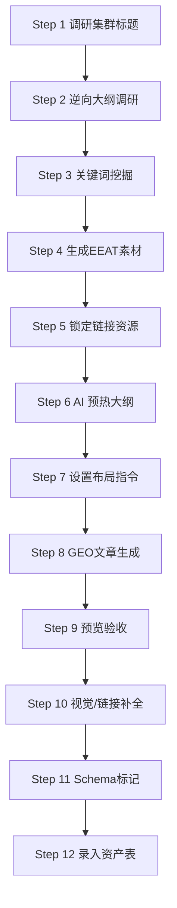

明白。以下是为您整理的 **B2B 高转化内容集群执行标准 SOP** 的全量内容。排版已升级为企业级技术文档风格，所有 1-12 步内容均完整保留。

```markdown
<div align="center">

# 📑 B2B 高转化内容集群执行标准 (SOP)
### B2B Content Cluster Strategy: EEAT + GEO + Structured Data

[](#)
[](#)
[](#)

> **适用场景**：产品型文章集群 / 工程类文章集群 / 认证类文章集群  
> **核心目标**：生产满足 EEAT + GEO + 结构化数据要求的高转化 B2B 内容资产。

</div>

<br/>

## 🧭 执行导航 (SOP Quick Access)

| 📂 策略规划 (Phase A) | ✍️ 创作执行 (Phase B) | 🚀 优化发布 (Phase C) |
| :--- | :--- | :--- |
| [01. 集群标题调研](#step-1) | [05. 内外链规划](#step-5) | [09. 质量验收检查](#step-9) |
| [02. 竞对大纲调研](#step-2) | [06. 向 AI 输入大纲](#step-6) | [10. 多媒体补全](#step-10) |
| [03. 关键词矩阵挖掘](#step-3) | [07. 布局与 EEAT 指令](#step-7) | [11. 结构化数据标记](#step-11) |
| [04. EEAT 素材生成](#step-4) | [08. GEO 文章生成](#step-8) | [12. 资产录入归档](#step-12) |

---

## 🏗️ 文章集群类型架构说明 (Cluster Definitions)

| 一级集群类型 | 核心要回答的问题 | 典型标题方向 | 适合覆盖的内容 | 漏斗阶段 | 商业价值 |
| :--- | :--- | :--- | :--- | :--- | :--- |
| **认知教育型** | 这是什么？ | What is X, X meaning, X explained | 定义、分类、基础知识、用途说明 | TOFU | 拉新流量、做主题入口 |
| **选型决策型** | 我该怎么选？ | How to choose, buying guide | 选购标准、采购要点、适配建议 | MOFU | 很强，适合导向产品页 |
| **对比替代型** | X 和 Y 的区别？ | X vs Y, compare, alternative | 对比、优缺点、替代方案 | MOFU | 很强，搜索意图明确 |
| **规格标准型** | 技术要求是什么？ | Specifications, standards, tolerance | 尺寸、参数、行业标准、技术要求 | TOFU/MOFU | 强，利于建立专业度 |
| **应用场景型** | 它适合谁？ | Best for hotel, for contractors | 人群场景、行业方案、项目适配 | MOFU/BOFU | 很强，最适合 B2B 转化 |
| **问题排查型** | 怎么做/解决？ | Manufacturing process, troubleshooting | 工艺流程、质量控制、解决方案 | TOFU/MOFU | 强，能体现工厂经验 |
| **认证合规型** | 符合什么法规？ | Certification, compliance req. | 认证介绍、标准解释、合规要求 | MOFU/BOFU | 中高，信任价值很强 |
| **供应商评估** | 怎么合作/判断？ | OEM vs ODM, factory audit checklist | 合作模式、MOQ、供应商筛选 | MOFU/BOFU | **最高，最接近询盘** |

---

<h2 id="step-1">Step 1：调研文章集群标题</h2>

**目标**：为上面 8 种集群类型各规划 5-10 篇文章标题。

**操作步骤**：
1. 使用 `templates/article-cluster-research-template.md` 进行标题调研。
2. 从以下维度出发构建标题：
   * **认知教育型集群**：回答“这是什么”。适合写：What is X?, X meaning, X explained, X types, X uses。这类文章负责拉新流量、做主题入口。
   * **选型决策型集群**：回答“我该怎么选”。适合写：how to choose, buying guide, selection guide, best X for Y, what to consider when buying X。这类很适合 B2B，商业价值很高。
   * **对比替代型集群**：回答“X 和 Y 有什么区别”。适合写：X vs Y, compare, alternative, pros and cons, which is better。这类经常带强意图，转化也不差。
   * **规格标准型集群**：回答“参数、标准、技术要求是什么”。适合写：specifications, dimensions, standards, tolerance, testing method, technical requirements。
   * **应用场景 / 解决方案型集群**：回答“它适合谁、适合什么项目”。适合写：best for hotel, for supermarkets, for retailers, for hospitals / villas / contractors。
   * **工艺质量 / 问题排查型集群**：回答“怎么做、为什么出问题、怎么解决”。适合写：manufacturing process, quality control, troubleshooting, why does X happen。
   * **认证合规型集群**：回答“要符合什么认证、标准、法规”。适合写：certification explained, compliance requirements, OEKO-TEX / CE / REACH / ASTM / ISO。
   * **采购合作 / 供应商评估型集群**：回答“怎么和你合作，怎么判断供应商靠不靠谱”。适合写：OEM vs ODM, MOQ, lead time, quotation guide, how to evaluate a manufacturer。
3. 参考来源：Google 自动补全、SEMrush Topic Research、行业论坛问题。
4. 标题评估标准：有搜索量、有商业意图、与产品强相关。

---

<h2 id="step-2">Step 2：竞对大纲调研 → 撰写自有大纲</h2>

**目标**：通过分析竞对内容，制定差异化且更优质的文章大纲。

**操作步骤**：
1. 在 Google 搜索确认好的文章标题（使用目标关键词）。
2. 打开前 5 名竞对文章，逐一记录：
   - H1/H2/H3 结构
   - 文章字数（估算）
   - 有无 FAQ、表格、操作步骤
   - 有无案例、数据引用
3. 分析共同点（必须覆盖）和差距（可以超越的点）。
4. 撰写自有大纲，要求：
   - 覆盖竞对共同覆盖的核心模块。
   - 加入竞对缺失的深度内容（工厂视角、实操案例）。
   - 预留 GEO 摘要位置（列表/答案/表格/步骤/FAQ 至少 3 种）。

---

<h2 id="step-3">Step 3：SEMrush 关键词挖掘</h2>

**目标**：从竞对文章中提取可用关键词，优化关键词布局。

**操作步骤**：
1. 在 SEMrush 中输入竞对文章 URL（Organic Research → Pages）。
2. 查看该页面排名的所有关键词。
3. 筛选条件：
   - 与文章大纲内容匹配
   - 搜索意图一致（信息型 / 商业型）
   - 搜索量 > 100（可根据行业调整）
4. 将关键词分为三类：
   - **主关键词（Primary）**：1 个，出现在标题、H1、首段。
   - **次级关键词（Secondary）**：3-5 个，分布在 H2/H3 和正文。
   - **LSI/长尾词（Supporting）**：5-10 个，自然融入段落。

---

<h2 id="step-4">Step 4：生成工厂视角 EEAT 素材（ChatGPT 辅助）</h2>

**目标**：生成第一人称的工厂经验与项目案例，增强 EEAT 中的 E（Experience）。

**ChatGPT Prompt 结构**：
```text
请扮演一名在[行业]工厂有15年经验的工程师/项目经理，基于以下大纲：[粘贴大纲] 以及以下产品案例链接：[粘贴案例链接]。请输出：
1. 工厂第一视角的实操经验（300字）：描述真实遇到过的[主题相关]问题和解决过程。
2. 项目第一人称案例（300字）：描述一个[主题相关]的真实项目经历，包含数据和结果。
```

---

<h2 id="step-5">Step 5：确认内链 + 准备外链引用内容</h2>

**目标**：在生成文章前锁定所有链接资源，确保内链和外链质量。

### 5.1 内链规划（先行确认）
| 内链类型 | 锚文本策略 | 来源页面 |
| :--- | :--- | :--- |
| 产品页内链 | 使用产品名称/功能词作为锚文本 | 核心产品落地页 |
| 案例页内链 | 使用行业+场景词作为锚文本 | 案例详情页 |
| 联系页内链 | 使用 CTA 词（"获取报价"等）作为锚文本 | /contact 页面 |
| 同集群文章内链 | 使用相关主题词作为锚文本 | 同集群其他文章 |

### 5.2 外链引用内容准备
外链优先级：1. 行业权威媒体/数据；2. 同行及上下游网站；3. Wikipedia 概念定义；4. 国际知名案例。

---

<h2 id="step-6">Step 6：向 AI 输入大纲</h2>

**目标**：让 AI 充分理解文章结构，为后续生成做准备。

**操作指令**：
```text
以下是我需要你创作的文章大纲，请先仔细阅读并确认理解：
[粘贴完整大纲]
请确认：1. 你理解逻辑结构；2. 你知道哪里需要深度技术内容；3. 你知道哪里需要插入工厂经验。
回复"已理解大纲"即可，不要开始写文章。
```

---

<h2 id="step-7">Step 7：输入关键词布局指令 + EEAT 标记指令</h2>

**关键词布局指令**：
- 主关键词出现在标题、H1、首段首句、Meta Title。
- 次级关键词分别出现在 H2/H3 标题及对应段落首句。
- 主关键词全文出现 3-5 次，次级关键词每个出现 2-3 次。

**EEAT 标记指令**：
在大纲指定位置嵌入 `[E-Experience]` (Step 4 经验段落)、`[E-Expertise]` (行业标准/工艺参数)、`[A-Authoritativeness]` (权威来源数据)。

---

<h2 id="step-8">Step 8：GEO 文章生成指令</h2>

**目标**：生成符合 AI 搜索引擎优化（GEO）要求的内容，不少于 2500 字。

**GEO 摘要要求（5 选 3）**：
- **列表摘要**：3-7 个要点的列表总结。
- **答案摘要**：H1 下方 2-3 句话直接回答核心问题。
- **表格摘要**：使用 Markdown 表格呈现参数对比。
- **操作步骤摘要**：使用有序列表 Step 1, 2, 3。
- **FAQ 摘要**：文章末尾提供 4-6 个问答。

---

<h2 id="step-9">Step 9：WordPress 预览检查清单</h2>

- [ ] 字数 ≥ 2500 字。
- [ ] EEAT 标记内容已正确插入。
- [ ] GEO 摘要格式已包含 ≥ 3 种摘要类型。
- [ ] 主关键词出现在：标题、H1、首段、Meta Title。
- [ ] Meta Description ≤ 160 字符且包含主词。

---

<h2 id="step-10">Step 10：多媒体与链接补全</h2>

- **配图**：每 500 字至少 1 张图，含 Alt 文本，命名：`[keyword]-[description].jpg`。
- **外链**：设置 `target="_blank" rel="noopener noreferrer"`。
- **内链**：确保产品页、案例页、联系页各 1 个内链。

---

<h2 id="step-11">Step 11：结构化数据标记 (Schema)</h2>

**Article Schema (示例)**：
```json
{
  "@context": "https://schema.org",
  "@type": "Article",
  "headline": "[文章标题]",
  "author": { "@type": "Organization", "name": "[公司名]" },
  "datePublished": "[日期]"
}
```
*(同时建议添加 FAQSchema 和 HowToSchema)*

---

<h2 id="step-12">Step 12：填写关键词词表归档</h2>

使用 `keyword-record-template.csv` 记录文章标题、核心词、搜索意图、月搜索量、内外链 URL 及 Schema 类型，形成可复查的内容资产记录。

---

## 📈 业务逻辑闭环图



---

## 📄 许可证 (License)
本项目基于 [MIT License](https://opensource.org/licenses/MIT) 开源。
```